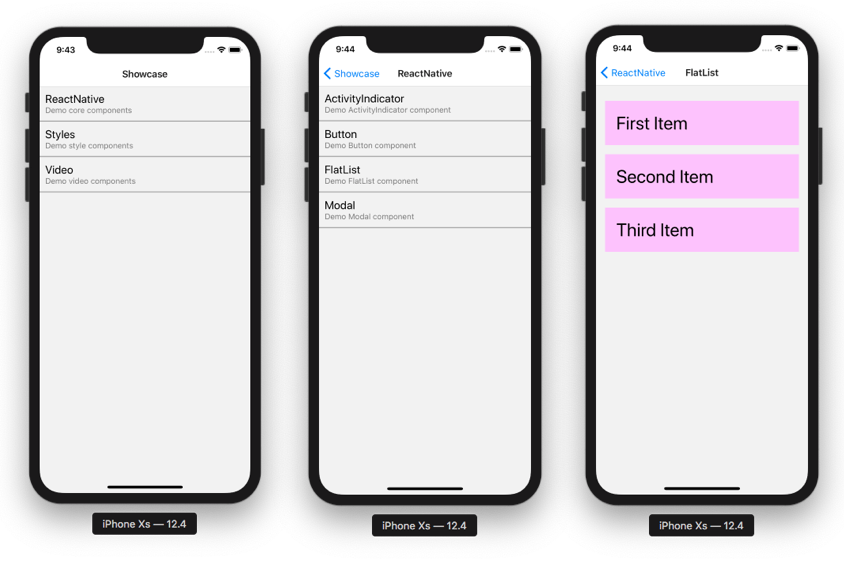

[](https://github.com/scommons/scommons-react-native/actions/workflows/ci.yml?query=workflow%3Aci+branch%3Amaster)
[](https://coveralls.io/github/scommons/scommons-react-native?branch=master)
[](https://index.scala-lang.org/scommons/scommons-react-native/scommons-react-native-core)
[](https://www.scala-js.org)

## Scala Commons React Native
Scala.js facades for core [react-native](https://facebook.github.io/react-native/docs/getting-started) utilities and components.

It uses excellent [scalajs-reactjs](https://github.com/shogowada/scalajs-reactjs) binding/facade library.



### How to add it to your project

```scala
val scommonsReactNativeVer = "1.0.0-SNAPSHOT"

libraryDependencies ++= Seq(
  "org.scommons.react-native" %%% "scommons-react-native-core" % scommonsReactNativeVer,
  "org.scommons.react-native" %%% "scommons-react-native-community" % scommonsReactNativeVer,
  "org.scommons.react-native" %%% "scommons-react-navigation" % scommonsReactNativeVer,
  "org.scommons.react-native" %%% "scommons-expo" % scommonsReactNativeVer,
  
  // ui module already includes all above modules
  "org.scommons.react-native" %%% "scommons-react-native-ui" % scommonsReactNativeVer,
  
  // mocks of native Components and APIs
  "org.scommons.react-native" %%% "scommons-react-native-test" % scommonsReactNativeVer % "test"
)
```

Latest `SNAPSHOT` version is published to [Sonatype Repo](https://oss.sonatype.org/content/repositories/snapshots/org/scommons/), just make sure you added
the proper dependency resolver to your `build.sbt` settings:
```scala
resolvers += "Sonatype Snapshots" at "https://oss.sonatype.org/content/repositories/snapshots/"
```

### How to use it

#### Demo Application

See [showcase/README.md](showcase/README.md) for how to build and run it.

* [live expo link](https://expo.io/@viktorpodzigun/showcase)
* [mobile browser](https://scommons.github.io/scommons-react-native/showcase.html)
* [web emulator](https://scommons.github.io/scommons-react-native/showcase.browser.html)

##### Demo App/UI Library Components

* [app](showcase/src/main/scala/showcase/app/ShowcaseApp.scala) => [tests](showcase/src/test/scala/showcase/app/ShowcaseAppSpec.scala)
  * [controller](showcase/src/main/scala/showcase/app/ShowcaseController.scala) => [tests](showcase/src/test/scala/showcase/app/ShowcaseControllerSpec.scala)
  * [screen](showcase/src/main/scala/showcase/app/ShowcaseScreen.scala) => [tests](showcase/src/test/scala/showcase/app/ShowcaseScreenSpec.scala)
  * [state](showcase/src/main/scala/showcase/app/ShowcaseState.scala) => [tests](showcase/src/test/scala/showcase/app/ShowcaseStateReducerSpec.scala)
  * [TaskController](showcase/src/main/scala/showcase/app/ShowcaseTaskController.scala) => [tests](showcase/src/test/scala/showcase/app/ShowcaseTaskControllerSpec.scala)
* Screens with API calls
  * [actions](showcase/src/main/scala/showcase/app/task/DemoTaskActions.scala) => [tests](showcase/src/test/scala/showcase/app/task/DemoTaskActionsSpec.scala)
  * [controller](showcase/src/main/scala/showcase/app/task/DemoTaskController.scala) => [tests](showcase/src/test/scala/showcase/app/task/DemoTaskControllerSpec.scala)
  * [screen](showcase/src/main/scala/showcase/app/task/DemoTaskScreen.scala) => [tests](showcase/src/test/scala/showcase/app/task/DemoTaskScreenSpec.scala)
* Reusable Custom UI Components
  * [ChoiceGroup](showcase/src/main/scala/showcase/app/ui/ChoiceGroupDemo.scala) => [tests](showcase/src/test/scala/showcase/app/ui/ChoiceGroupDemoSpec.scala)

##### React Native Styling Examples

Note: Many examples are from an excellent book [React Native in Action](https://www.manning.com/books/react-native-in-action) by [Nader Dabit](https://github.com/dabit3)

* [Border Style](showcase/src/main/scala/showcase/app/style/BorderStyleDemo.scala) => [tests](showcase/src/test/scala/showcase/app/style/BorderStyleDemoSpec.scala)
* [Border Radius](showcase/src/main/scala/showcase/app/style/BorderRadiusDemo.scala) => [tests](showcase/src/test/scala/showcase/app/style/BorderRadiusDemoSpec.scala)
* [Margin](showcase/src/main/scala/showcase/app/style/MarginStyleDemo.scala) => [tests](showcase/src/test/scala/showcase/app/style/MarginStyleDemoSpec.scala)
* [Padding](showcase/src/main/scala/showcase/app/style/PaddingStyleDemo.scala) => [tests](showcase/src/test/scala/showcase/app/style/PaddingStyleDemoSpec.scala)
* [Position](showcase/src/main/scala/showcase/app/style/PositionStyleDemo.scala) => [tests](showcase/src/test/scala/showcase/app/style/PositionStyleDemoSpec.scala)
* [TextStyle](showcase/src/main/scala/showcase/app/style/TextStyleDemo.scala) => [tests](showcase/src/test/scala/showcase/app/style/TextStyleDemoSpec.scala)
* [ProfileCard (with Images)](showcase/src/main/scala/showcase/app/style/ProfileCard.scala) => [tests](showcase/src/test/scala/showcase/app/style/ProfileCardSpec.scala)

### Facades

#### react-native

* [Components](https://facebook.github.io/react-native/docs/activityindicator):
  * [ActivityIndicator](showcase/src/main/scala/showcase/ActivityIndicatorDemo.scala) => [tests](showcase/src/test/scala/showcase/ActivityIndicatorDemoSpec.scala)
  * [Button](showcase/src/main/scala/showcase/ButtonDemo.scala) => [tests](showcase/src/test/scala/showcase/ButtonDemoSpec.scala)
  * [FlatList](showcase/src/main/scala/showcase/FlatListDemo.scala) => [tests](showcase/src/test/scala/showcase/FlatListDemoSpec.scala)
  * [Image](showcase/src/main/scala/showcase/ImageDemo.scala) => [tests](showcase/src/test/scala/showcase/ImageDemoSpec.scala)
    * [StaticResource](showcase/src/main/scala/showcase/app/ShowcaseImages.scala)
  * [KeyboardAvoidingView](showcase/src/main/scala/showcase/KeyboardAvoidingViewDemo.scala) => [tests](showcase/src/test/scala/showcase/KeyboardAvoidingViewDemoSpec.scala)
  * [Modal](showcase/src/main/scala/showcase/ModalDemo.scala) => [tests](showcase/src/test/scala/showcase/ModalDemoSpec.scala)
  * [ScrollView](showcase/src/main/scala/showcase/ScrollViewDemo.scala) => [tests](showcase/src/test/scala/showcase/ScrollViewDemoSpec.scala)
  * [StatusBar](showcase/src/main/scala/showcase/app/ShowcaseRoot.scala) => [tests](showcase/src/test/scala/showcase/app/ShowcaseRootSpec.scala)
  * [Switch](showcase/src/main/scala/showcase/SwitchDemo.scala) => [tests](showcase/src/test/scala/showcase/SwitchDemoSpec.scala)
  * [TextInput](showcase/src/main/scala/showcase/TextInputDemo.scala) => [tests](showcase/src/test/scala/showcase/TextInputDemoSpec.scala)
  * [TouchableHighlight](showcase/src/main/scala/showcase/TouchableHighlightDemo.scala) => [tests](showcase/src/test/scala/showcase/TouchableHighlightDemoSpec.scala)
  * [TouchableOpacity](showcase/src/main/scala/showcase/TouchableOpacityDemo.scala) => [tests](showcase/src/test/scala/showcase/TouchableOpacityDemoSpec.scala)

* [APIs](https://facebook.github.io/react-native/docs/accessibilityinfo):
  * [Alert](showcase/src/main/scala/showcase/AlertDemo.scala) => [tests](showcase/src/test/scala/showcase/AlertDemoSpec.scala)
  * [Platform](showcase/src/main/scala/showcase/PlatformDemo.scala) => [tests](showcase/src/test/scala/showcase/PlatformDemoSpec.scala)
  * [Style](showcase/src/main/scala/showcase/StyleDemo.scala) => [tests](showcase/src/test/scala/showcase/StyleDemoSpec.scala)
  * [TextStyle](showcase/src/main/scala/showcase/TextStyleDemo.scala) => [tests](showcase/src/test/scala/showcase/TextStyleDemoSpec.scala)
  * [ViewStyle](showcase/src/main/scala/showcase/ViewStyleDemo.scala) => [tests](showcase/src/test/scala/showcase/ViewStyleDemoSpec.scala)

#### react-native-community

* [@react-native-picker/picker](https://github.com/react-native-picker/picker)
  * [Picker](showcase/src/main/scala/showcase/app/community/PickerDemo.scala) => [tests](showcase/src/test/scala/showcase/app/community/PickerDemoSpec.scala)
* [react-native-safe-area-context](https://github.com/th3rdwave/react-native-safe-area-context)
  * [SafeAreaProvider](showcase/src/main/scala/showcase/app/ShowcaseRoot.scala) => [tests](showcase/src/test/scala/showcase/app/ShowcaseRootSpec.scala)
  * [SafeAreaView](showcase/src/main/scala/showcase/app/community/WebViewDemo.scala) => [tests](showcase/src/test/scala/showcase/app/community/WebViewDemoSpec.scala)
* [react-native-svg](https://github.com/react-native-community/react-native-svg)
  * [SvgXml](showcase/src/main/scala/showcase/app/community/SvgXmlDemo.scala) => [tests](showcase/src/test/scala/showcase/app/community/SvgXmlDemoSpec.scala)
  * [SvgCss](showcase/src/main/scala/showcase/app/community/SvgCssDemo.scala) => [tests](showcase/src/test/scala/showcase/app/community/SvgCssDemoSpec.scala)
* [react-native-webview](showcase/src/main/scala/showcase/app/community/WebViewDemo.scala) => [tests](showcase/src/test/scala/showcase/app/community/WebViewDemoSpec.scala)
* [react-native-htmlview](showcase/src/main/scala/showcase/app/community/HTMLViewDemo.scala) => [tests](showcase/src/test/scala/showcase/app/community/HTMLViewDemoSpec.scala)
* [react-native-syntax-highlighter](showcase/src/main/scala/showcase/app/community/SyntaxHighlighterDemo.scala) => [tests](showcase/src/test/scala/showcase/app/community/SyntaxHighlighterDemoSpec.scala)

#### react-navigation (v6)

* [Components](https://reactnavigation.org/docs/hello-react-navigation/)
  * [StackNavigator](showcase/src/main/scala/showcase/app/ReactNativeDemoScreen.scala) => [tests](showcase/src/test/scala/showcase/app/ReactNativeDemoScreenSpec.scala)
  * [BottomTabNavigator](showcase/src/main/scala/showcase/app/ShowcaseRoot.scala) => [tests](showcase/src/test/scala/showcase/app/ShowcaseRootSpec.scala)

* [APIs](https://reactnavigation.org/docs/navigation-prop/)
  * [Navigation](navigation/src/main/scala/scommons/react/navigation/Navigation.scala) => [tests](navigation/src/test/scala/scommons/react/navigation/NavigationSpec.scala)

#### expo modules

[expo docs](https://docs.expo.io/versions/latest/)

* [expo-asset](showcase/src/main/scala/showcase/app/expo/AssetDemo.scala) => [tests](showcase/src/test/scala/showcase/app/expo/AssetDemoSpec.scala)
  * [preloading-and-caching-assets](https://docs.expo.io/guides/preloading-and-caching-assets/) => [ShowcaseApp](showcase/src/main/scala/showcase/app/ShowcaseApp.scala)
* [expo-font](showcase/src/main/scala/showcase/app/expo/FontDemo.scala) => [tests](showcase/src/test/scala/showcase/app/expo/FontDemoSpec.scala)
* [@expo/vector-icons](showcase/src/main/scala/showcase/app/ShowcaseRoot.scala) => [tests](showcase/src/test/scala/showcase/app/ShowcaseRootSpec.scala)
* [expo-av](https://docs.expo.io/versions/latest/sdk/video/)
  * [Video](showcase/src/main/scala/showcase/app/expo/av/VideoDemo.scala) => [tests](showcase/src/test/scala/showcase/app/expo/av/VideoDemoSpec.scala)
* [expo-sqlite](https://docs.expo.io/versions/latest/sdk/sqlite/)
  * [SQLite](showcase/src/main/scala/showcase/app/expo/sqlite/SQLiteDemo.scala) => [tests](showcase/src/test/scala/showcase/app/expo/sqlite/SQLiteDemoSpec.scala)
  * See [scommons-websql](https://github.com/scommons/scommons-websql) for how to:
    * use high-level `scommons-websql-io` module with expo SQLite
    * use `scommons-websql-migrations` to automate your DB schema versioning

### How to Build

To build and run all the tests use the following command:
```bash
sbt test
```

## Documentation

You can find more documentation [here](https://scommons.github.io/scommons-react-native)

### Examples

You can find more examples [here](https://github.com/scommons/scommons-examples-mobile)
