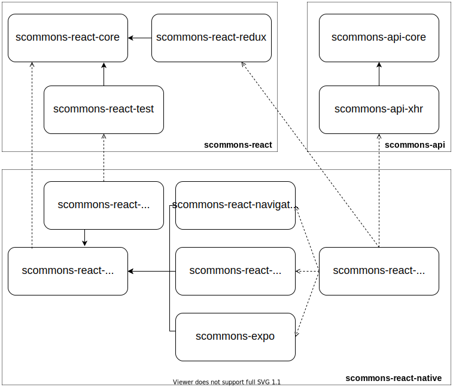

Welcome to the **Scala Commons React Native** documentation page!

### Overview

[Preview](https://www.draw.io/?chrome=0&lightbox=1&url=https%3A%2F%2Fraw.githubusercontent.com%2Fscommons%2Fscommons-react-native%2Fmaster%2Fdocs%2Fdrawio%2Foverview.svg%3Ft%3D0) | [Edit](https://www.draw.io/?title=overview.svg&url=https%3A%2F%2Fraw.githubusercontent.com%2Fscommons%2Fscommons-react-native%2Fmaster%2Fdocs%2Fdrawio%2Foverview.svg%3Ft%3D0)

### Examples

Many examples are from an excellent book [React Native in Action](https://www.manning.com/books/react-native-in-action) by [Nader Dabit](https://github.com/dabit3)

ShowcaseApp:

- [ShowcaseApp](https://github.com/scommons/scommons-react-native/tree/master/showcase)
  ([mobile](/scommons-react-native/showcase.html), [web emulator](/scommons-react-native/showcase.browser.html))

    

You can find more examples [here](https://github.com/scommons/scommons-examples-mobile)
