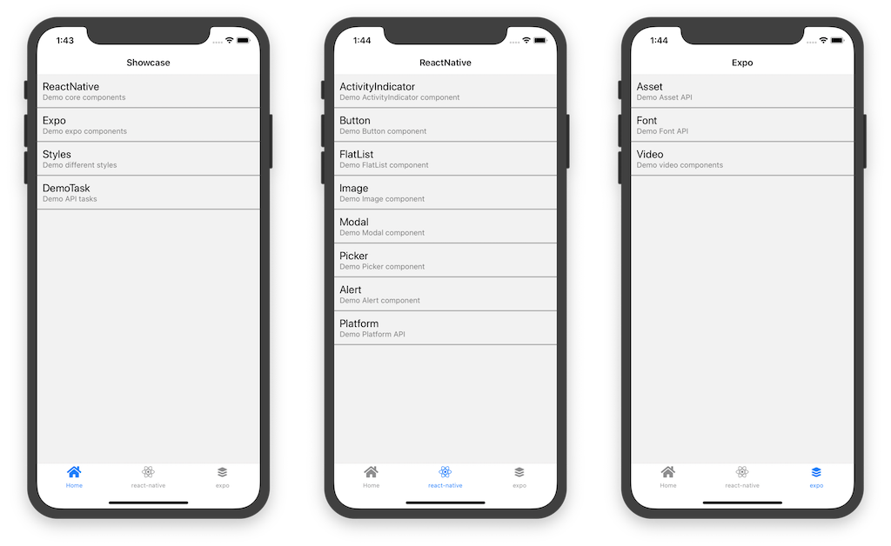

## scommons-react-native-showcase
Example usages of react-native components/modules written in Scala.js.

Almost all examples are from a great book [React Native in Action](https://github.com/dabit3/react-native-in-action)



### How to run it in your device

* [live expo link](https://expo.io/@viktorpodzigun/showcase)
* [mobile browser](https://scommons.org/scommons-react-native/showcase.html)
* [web emulator](https://scommons.org/scommons-react-native/showcase.browser.html)

#### How to Build/Run Showcase App locally using Expo

First, build the application with the following command:
```bash
sbt "project scommons-react-native-showcase" fastOptJS
```

Then, please make sure you have `expo-cli` **version 4** installed
globally:
```bash
npm i expo-cli@5 -g
```

To run the application locally, use the following command(s):
```bash
cd showcase
expo start --ios
#or:
expo start --web
#or:
expo start --android
```

#### How to publish web app

To build web-assets use the following command:
```bash
./script/docs_gen_assets.sh
```

You can check the result by running docs server locally:
```bash
./script/docs_server.sh

open http://127.0.0.1:4000/scommons-react-native/
```
